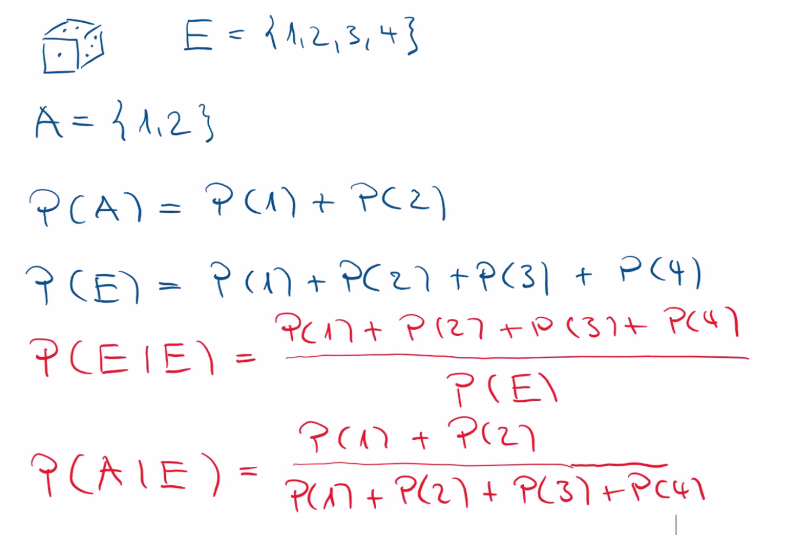
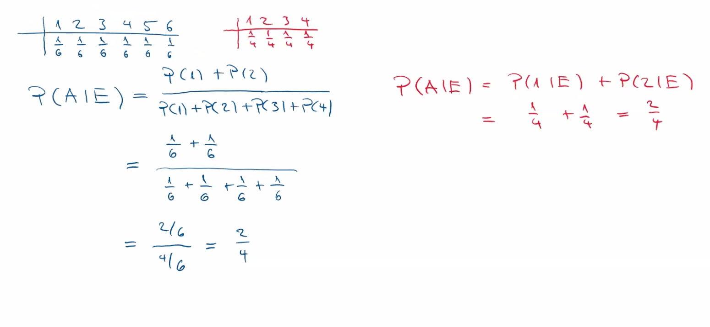
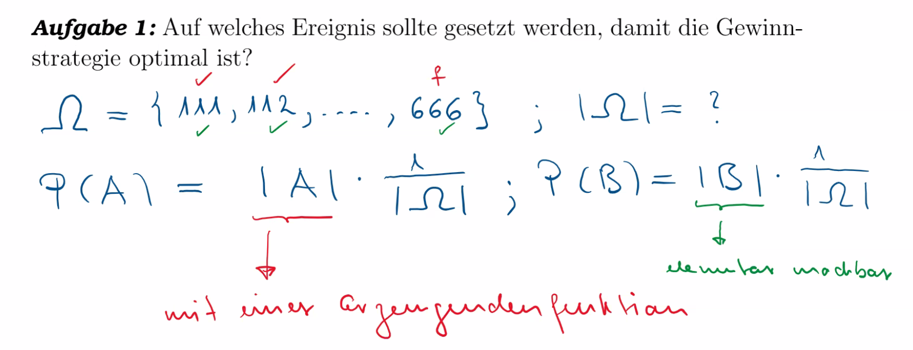
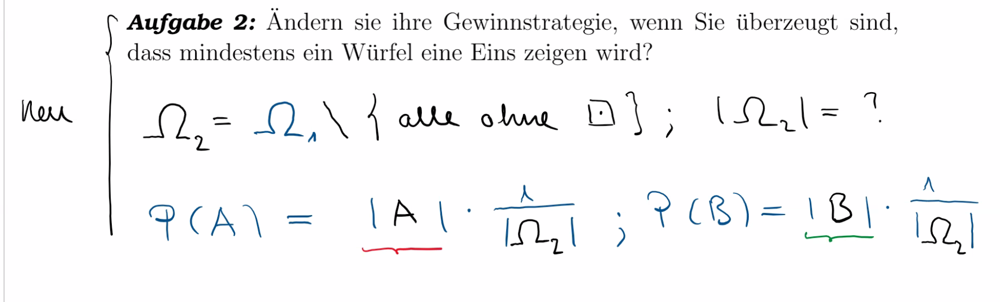

# DMATH-CODE — SW 02: Bedingte Wahrscheinlichkeit

> **Modul:** DMATH-CODE, HSLU | **Dozent:** Dr. Reto Berger | **Semester:** Frühlingssemester 25

---

## 🎯 Lernziele

1. **Mehrstufige Zufallsexperimente verstehen** — Sie wissen, was ein mehrstufiges Zufallsexperiment ist und können es mit einem **Wahrscheinlichkeitsbaum** beschreiben.
2. **Unabhängigkeit von Ereignissen** — Sie verstehen, wann zwei Ereignisse unabhängig sind und können dies formal nachweisen.
3. **Bedingte Wahrscheinlichkeiten berechnen** — Sie können $P(A|E)$ korrekt berechnen und interpretieren.
4. **Produktregel anwenden** — Sie können die Produktregel $P(A \cap E) = P(E) \cdot P(A|E)$ nutzen, um Wahrscheinlichkeiten in Baumdiagrammen zu berechnen.
5. **Erzeugende Funktionen zur Zählung nutzen** — Sie können mit `np.poly1d` Wahrscheinlichkeiten für Summen von Würfeln berechnen.

---

## 📖 Wichtigste Begriffe

| Begriff | Definition |
|---------|-----------|
| **Bedingte Wahrscheinlichkeit** $P(\omega \| E)$ | Die Wahrscheinlichkeit eines Ergebnisses $\omega$, wenn bekannt ist, dass nur Ergebnisse aus $E \subset \Omega$ vorkommen: $P(\omega\|E) = \frac{P(\omega \cap E)}{P(E)}$ |
| **Unabhängigkeit** | Zwei Ereignisse $A$ und $E$ heissen *unabhängig*, wenn $P(A\|E) = P(A)$, d.h. die Information $E$ verändert die Wahrscheinlichkeit von $A$ nicht. |
| **Produktregel** | Für unabhängige Ereignisse gilt: $P(A \cap E) = P(A) \cdot P(E)$ |
| **Mehrstufiges Zufallsexperiment** | Ein Zufallsexperiment, das in **mehrere gekoppelte** Teil-Zufallsexperimente zerlegt werden kann. |
| **Wahrscheinlichkeitsbaum** | Grafische Darstellung eines mehrstufigen Zufallsexperiments, bei dem Kanten mit bedingten Wahrscheinlichkeiten gewichtet werden. |
| **Knoten des Baums** | Repräsentieren die Spielzwischenstände / Zustände des Experiments. |
| **Blätter des Baums** | Repräsentieren die Endergebnisse des Experiments. |
| **Kanten des Baums** | Werden mit den bedingten Wahrscheinlichkeiten $P(\text{Knoten B} \| \text{Knoten A})$ gewichtet. |
| **Erzeugende Funktion** | Ein Polynom, dessen Koeffizienten die Anzahl günstiger Ergebnisse für jede Augensumme angeben. Für einen fairen 6-seitigen Würfel: $p(x) = x + x^2 + x^3 + x^4 + x^5 + x^6$. |
| **Geburtstagsparadoxon** | Die überraschend hohe Wahrscheinlichkeit, dass in einer Gruppe von Personen mindestens zwei den gleichen Geburtstag haben. |

---

## 📐 Definitionen, Sätze & Beweise

### Definition 1: Bedingte Wahrscheinlichkeit

> Sei $P$ eine Wahrscheinlichkeitsfunktion zu einem Zufallsexperiment mit Ergebnismenge $\Omega = \{\omega_1, \omega_2, \ldots, \omega_n\}$.
>
> Wenn bekannt ist, dass bei diesem Zufallsexperiment nur noch Ergebnisse aus einem Ereignis $E \subset \Omega$ vorkommen, dann heisst die Zahl
>
> $$P(\omega|E) = \frac{P(\omega \cap E)}{P(E)}$$
>
> **Wahrscheinlichkeit für** das Ergebnis $\omega$ **unter der Bedingung** $E$.

**Eigenschaften der bedingten Wahrscheinlichkeitsfunktion $P(\cdot | E)$:**

- $P(\cdot | E)$ ordnet nur noch den Ergebnissen $\omega \in E$ positive Wahrscheinlichkeiten zu
- Für alle Ergebnisse $\omega_1, \omega_2, \ldots, \omega_m \in E$ gilt: $P(\omega_1|E) + P(\omega_2|E) + \ldots + P(\omega_m|E) = 1$
- Es gilt: $P(\omega \cap E) = P(E) \cdot P(\omega|E)$ (**Produktregel**)

**Intuitive Erklärung:** Die bedingte Wahrscheinlichkeit «zoomt in» das Ereignis $E$ hinein. Alle Ergebnisse ausserhalb von $E$ werden auf 0 gesetzt, und die verbleibenden Wahrscheinlichkeiten werden so skaliert, dass sie wieder zu 1 summieren (Division durch $P(E)$).

#### 📸 Dozent-Erläuterung: Bedingte WS am Würfelbeispiel

> Der Dozent erklärte die bedingte Wahrscheinlichkeit anhand eines konkreten Würfelbeispiels mit $E = \{1,2,3,4\}$ und $A = \{1,2\}$. Die Skizze zeigt, wie $P(A|E)$ sowohl über die Definition (Bruch) als auch über die neue bedingte WS-Funktion berechnet werden kann — und beide Wege zum gleichen Ergebnis $\frac{2}{4}$ führen.





> **Kernaussage der Skizze:** Ob man $P(A|E) = \frac{P(A \cap E)}{P(E)} = \frac{1/6 + 1/6}{4/6} = \frac{2}{4}$ rechnet oder $P(A|E) = P(1|E) + P(2|E) = \frac{1}{4} + \frac{1}{4} = \frac{2}{4}$ — das Ergebnis ist identisch. Die bedingte WS-Funktion definiert eine **neue, gültige Wahrscheinlichkeitsfunktion** auf dem eingeschränkten Ergebnisraum $E$.

---

**Zahlenbeispiel:** Ein Zufallsgenerator gibt uniform eine der Zahlen 1, 2, 3, 4, 5, 6, 7, 8, 9, 10 zurück.

Bedingung: $E = \{2, 4, 6, 8, 10\}$ (gerade Zahlen), also $P(E) = \frac{5}{10} = \frac{1}{2}$.

| Berechnung | Ergebnis |
|-----------|----------|
| $P(2) = P(E) \cdot P(2\|E) = \frac{5}{10} \cdot \frac{1}{5} = \frac{1}{10}$ | $\Rightarrow P(2\|E) = \frac{1/10}{1/2} = \frac{1}{5}$ |
| $P(4) = P(E) \cdot P(4\|E) = \frac{5}{10} \cdot \frac{1}{5} = \frac{1}{10}$ | $\Rightarrow P(4\|E) = \frac{1/10}{1/2} = \frac{1}{5}$ |
| $P(\text{3er-Zahl}) = \frac{3}{10}$ | aber $P(\text{3er-Zahl}\|E) = \frac{1/10}{5/10} = \frac{1}{5}$ |
| $P(\text{5er-Zahl}) = \frac{2}{10}$ | aber $P(\text{5er-Zahl}\|E) = \frac{1/10}{5/10} = \frac{1}{5}$ |

> **Erkenntnis:** Zusätzliche Informationen zum Ausgang eines Zufallsexperiments **können** die Wahrscheinlichkeiten verändern — aber auch gleich lassen (→ Unabhängigkeit)!

---

### Definition 2: Unabhängigkeit

> Zwei **Ereignisse $A$ und $E$** heissen **unabhängig**, wenn
>
> $$P(A|E) = P(A)$$
>
> gilt.

Die Information $E$ verändert also für das Ereignis $A$ die bedingte Wahrscheinlichkeit $P(A|E)$ **nicht**.

**Daraus folgt die Produktregel für unabhängige Ereignisse:**

$$\boxed{P(A \cap E) = P(E) \cdot P(A|E) = P(E) \cdot P(A) = P(A) \cdot P(E)}$$

**Beweisskizze (Symmetrie der Unabhängigkeit — Aufgabe 3):**

Wenn $A$ und $E$ unabhängig sind, dann gilt auch $P(E|A) = P(E)$:

$$P(E|A) = \frac{P(E \cap A)}{P(A)} = \frac{P(E) \cdot P(A)}{P(A)} = P(E) \quad \blacksquare$$

**Intuition:** Unabhängigkeit bedeutet: «Das Eintreten von $E$ sagt mir nichts Neues über $A$.» Es ist eine **symmetrische** Beziehung — wenn $A$ unabhängig von $E$ ist, dann ist auch $E$ unabhängig von $A$.

#### 📸 Lektionsfolie: Produktregel & Aufgabe 3 (korrigierte Version)

> Diese Folie zeigt die Herleitung der **Produktregel für unabhängige Ereignisse** direkt aus der Definition. Ausserdem wird **Aufgabe 3** gestellt: Die Symmetrie der Unabhängigkeit soll mit einer kurzen Rechnung begründet werden ($P(E|A) = P(E)$).


> ⚠️ **Hinweis vom Dozenten:** Die Originalversion im Repository enthielt einen Typo — dies ist die **korrigierte Version**.

---

### Mehrstufige Zufallsexperimente & Wahrscheinlichkeitsbäume

> Ein Zufallsexperiment kann oft in **mehrere gekoppelte** Zufallsexperimente zerlegt werden. Den Ablauf, also das **mehrstufige Zufallsexperiment**, können wir in einem **Wahrscheinlichkeitsbaum** darstellen.

**Komponenten des Wahrscheinlichkeitsbaums:**

| Komponente | Bedeutung |
|-----------|-----------|
| **Knoten** | Spielzwischenstände |
| **Blätter** | Endergebnisse des Experiments |
| **Kanten** | Bedingte Wahrscheinlichkeiten $P(\text{Kind} \| \text{Eltern})$ |
| **Pfadwahrscheinlichkeit** | Produkt aller Kantengewichte auf dem Pfad (Produktregel) |

**Beispiel (Tennisturnier):** Zwei Personen $A$ und $B$ spielen ein Turnier. Regel: Wer zuerst 2 Spiele nacheinander oder zuerst insgesamt 3 Spiele gewinnt, ist Turniersieger.

Der Wahrscheinlichkeitsbaum hat bis zu 5 Stufen, und jede Kante wird mit $P(A)$ bzw. $P(B) = 1 - P(A)$ gewichtet.

#### 📸 Lektions-Skizze: Wahrscheinlichkeitsbaum (Tennisturnier)

> Der Dozent zeichnete den vollständigen Wahrscheinlichkeitsbaum des Tennisturniers. Die **Knoten** sind die Spielzwischenstände, die **Blätter** (rot eingekreist) die Endergebnisse (Turnierentscheidung). An den **Kanten** stehen die bedingten Wahrscheinlichkeiten wie $P(A|A)$, $P(B|A)$ usw. Die inneren Verzweigungen repräsentieren die **Zwischenergebnisse** — das Turnier ist noch nicht entschieden.


> **Lesehinweis:** Die roten Kreise markieren die **Blätter** (= Turnier ist entschieden). Die blauen Annotationen zeigen die bedingten Wahrscheinlichkeiten an den Kanten, z.B. $P(A|AB)$ = «A gewinnt das nächste Spiel, gegeben der bisherige Spielstand ist AB».

---

## 📝 Formeln & Rechenregeln

### Kernformeln dieser Woche

| # | Formel | Beschreibung | Variablen |
|---|--------|-------------|-----------|
| 1 | $P(\omega\|E) = \frac{P(\omega \cap E)}{P(E)}$ | **Bedingte Wahrscheinlichkeit** | $\omega$: Ergebnis, $E$: Bedingung mit $P(E) > 0$ |
| 2 | $P(A \cap E) = P(E) \cdot P(A\|E)$ | **Produktregel** (Multiplikationssatz) | Umstellung von Formel 1; für Baumdiagramme |
| 3 | $P(A\|E) = P(A) \iff$ unabhängig | **Unabhängigkeitskriterium** | Information $E$ ändert nichts an $P(A)$ |
| 4 | $P(A \cap E) = P(A) \cdot P(E)$ | **Produktregel bei Unabhängigkeit** | Folgt aus 2 + 3 |
| 5 | $P(\text{Pfad}) = \prod_{i} P(\text{Kante}_i)$ | **Pfadregel im Baum** | Produkt aller bedingten WS entlang des Pfades |
| 6 | $P(\text{Blatt}) = \sum_{\text{Pfade}} P(\text{Pfad})$ | **Summenregel** | Gewünschtes Ereignis = Summe aller zugehörigen Pfade |

### Formeln aus SW 01 (weiterhin benötigt)

| Formel | Beschreibung |
|--------|-------------|
| $P(E) = \frac{\|E\|}{\|\Omega\|}$ | Laplace-Wahrscheinlichkeit |
| $P(\overline{A}) = 1 - P(A)$ | Gegenereignis |
| $P(A \cup B) = P(A) + P(B) - P(A \cap B)$ | Inklusion-Exklusion |
| $\binom{n}{k} = \frac{n!}{k!(n-k)!}$ | Binomialkoeffizient |

### ⚠️ Randfälle

- **$P(E) = 0$:** Bedingte Wahrscheinlichkeit $P(\omega|E)$ ist **nicht definiert** wenn $P(E) = 0$!
- **Unabhängigkeit ≠ disjunkt:** Disjunkte Ereignisse ($A \cap B = \emptyset$) sind **abhängig** wenn $P(A), P(B) > 0$, denn $P(A \cap B) = 0 \neq P(A) \cdot P(B)$.
- **Unabhängigkeit ist symmetrisch:** $A$ unabhängig von $E$ $\iff$ $E$ unabhängig von $A$.

---

## 📊 Vergleiche & Klassifizierungen

### Bedingte vs. unbedingte Wahrscheinlichkeit

| Eigenschaft | Unbedingte WS $P(A)$ | Bedingte WS $P(A \| E)$ |
|-------------|---------------------|------------------------|
| **Was wird genutzt** | Gesamte Ergebnismenge $\Omega$ | Nur Ergebnisse in $E$ |
| **Formel** | $\frac{\|A\|}{\|\Omega\|}$ (Laplace) | $\frac{P(A \cap E)}{P(E)}$ |
| **Information** | Keine Zusatzinfo | Wissen, dass $E$ eingetreten ist |
| **Summe** | $\sum_{\omega \in \Omega} P(\omega) = 1$ | $\sum_{\omega \in E} P(\omega \| E) = 1$ |

### Unabhängig vs. abhängig

| Eigenschaft | Unabhängig | Abhängig |
|-------------|-----------|---------|
| **Bedingung** | $P(A\|E) = P(A)$ | $P(A\|E) \neq P(A)$ |
| **Produktregel** | $P(A \cap E) = P(A) \cdot P(E)$ | $P(A \cap E) = P(E) \cdot P(A\|E)$ |
| **Interpretation** | $E$ sagt nichts über $A$ | $E$ verändert die WS von $A$ |
| **Beispiel** | Roter ungerade Würfel vs. Summe ungerade (Aufg. 4) | Münzwurf: 9× Kopf gegeben → 1. Wurf war Kopf wahrscheinlicher |

### Direkte Berechnung vs. Erzeugende Funktion

| Ansatz | Wann verwenden | Vorteil |
|--------|---------------|---------|
| **Abzählen** | Wenige Ergebnisse, kleiner Ergebnisraum | Verständlich, transparent |
| **Erzeugende Funktion** | Summe mehrerer Würfel, grosse $\|\Omega\|$ | Automatische Auszählung via Polynommultiplikation |
| **Simulation** | Komplexe Probleme, Verifikation | Intuitive Ergebnisse, kein exaktes Abzählen nötig |

---

## 💻 Code-Beispiele (Python)

### Monty-Hall-Problem — Simulation

**Mathematischer Hintergrund:** Das Monty-Hall-Problem (auch Ziegenproblem) zeigt, wie bedingte Wahrscheinlichkeiten die Intuition täuschen können. Hinter drei Türen verbirgt sich ein Auto und zwei Ziegen. Nach der Wahl öffnet der Moderator eine andere Tür mit einer Ziege. Die Frage: Soll man wechseln?

- **Nicht wechseln:** Man gewinnt nur, wenn die erste Wahl richtig war → $P = \frac{1}{3}$
- **Wechseln:** Man gewinnt, wenn die erste Wahl falsch war → $P = \frac{2}{3}$

```python
import random

# Simulation des Monty-Hall-Problems
numGames = 1_000_000
playerA_winCar = 0   # Spieler A bleibt bei seiner ersten Wahl
playerA_winGoat = 0
playerB_winCar = 0   # Spieler B wechselt nach der ersten Wahl
playerB_winGoat = 0

gates = ['goat', 'goat', 'car']

for _ in range(numGames):
    random.shuffle(gates)                   # Zufällige Anordnung
    choise = random.randint(0, 2)           # Zufällige Türwahl
    if gates[choise] == 'car':
        playerA_winCar += 1                 # Bleibt beim Auto
        playerB_winGoat += 1                # Wechselt zur Ziege
    else:
        playerA_winGoat += 1                # Bleibt bei der Ziege
        playerB_winCar += 1                 # Wechselt zum Auto,
                                            # weil andere Ziege gezeigt wird

print('Spielstrategie ohne Wechseln')
print('Auto gewonnen:', playerA_winCar / numGames)      # ≈ 0.333
print('Ziege gewonnen:', playerA_winGoat / numGames)     # ≈ 0.667

print('\nSpielstrategie mit Wechseln')
print('Auto gewonnen:', playerB_winCar / numGames)      # ≈ 0.667
print('Ziege gewonnen:', playerB_winGoat / numGames)     # ≈ 0.333
```

**Ergebnis:** Wechseln verdoppelt die Gewinnchance von $\frac{1}{3}$ auf $\frac{2}{3}$!

> **`random.shuffle(list)`** — Mischt die Liste *in-place* zufällig.
> **`random.randint(a, b)`** — Zufällige ganze Zahl $n$ mit $a \leq n \leq b$ (inklusive).

**Warum funktioniert die vereinfachte Simulation?** Wenn der Spieler anfangs das Auto wählt ($P = 1/3$), verliert er durch Wechseln. Wenn er anfangs eine Ziege wählt ($P = 2/3$), muss der Moderator die andere Ziege öffnen, und der Wechsel führt zum Auto. Deshalb reicht es, nur die erste Wahl zu simulieren — das Verhalten des Moderators ist deterministisch gegeben der ersten Wahl.

---

### Erzeugende Funktionen mit NumPy — Summe von Würfeln

**Mathematischer Hintergrund:** Um die Wahrscheinlichkeit einer bestimmten Augensumme bei 3 Würfeln zu berechnen, kann man eine **erzeugende Funktion** verwenden. Für einen fairen 6-seitigen Würfel ist die erzeugende Funktion:

$$p(x) = x^1 + x^2 + x^3 + x^4 + x^5 + x^6$$

Die Koeffizienten von $p(x)^3$ geben dann die Anzahl Möglichkeiten für jede Augensumme bei 3 Würfeln an.

```python
import numpy as np

# Erzeugende Funktion für einen fairen 6-seitigen Würfel
# Koeffizienten von x^6 bis x^0: [1, 1, 1, 1, 1, 1, 0]
# (x^6 + x^5 + x^4 + x^3 + x^2 + x^1 + 0·x^0)
p = np.poly1d([1, 1, 1, 1, 1, 1, 0])

# Erzeugende Funktion für 3 Würfel: p(x)^3
generatingFunction = p**3
print(generatingFunction)
# Koeffizienten: [1, 3, 6, 10, 15, 21, 25, 27, 27, 25, 21, 15, 10, 6, 3, 1, 0, 0, 0]
# Entspricht:    x^18 + 3x^17 + 6x^16 + ... + 1·x^3

# Grad des Polynoms
degree = generatingFunction.o  # = 18
print('Grad des Polynoms:', degree)

# Summe der Koeffizienten von x^3 bis x^9 (Aufgabe 1a: Summe ≤ 9)
# Dies gibt die Anzahl günstiger Ergebnisse für Ereignis A
koeff_summe_max_9 = sum(generatingFunction.c[degree - 9 : degree + 1])
print('Anzahl Ergebnisse mit Summe 3-9:', koeff_summe_max_9)  # = 81

# P(A) = 81/216 = 0.375  (|Ω| = 6³ = 216)
print('P(Summe ≤ 9) =', koeff_summe_max_9 / 6**3)  # = 0.375
```

> **`np.poly1d([a_n, ..., a_1, a_0])`** — Erstellt ein Polynom $a_n x^n + \ldots + a_1 x + a_0$. Die Koeffizienten werden vom **höchsten** zum niedrigsten Grad angegeben.
> **`.o`** — Gibt den Grad (Order) des Polynoms zurück.
> **`.c`** — Array der Koeffizienten (vom höchsten zum niedrigsten Grad).
> **`p**3`** — Berechnet $p(x)^3$ durch Polynommultiplikation (= Faltung der Koeffizienten).

#### 📸 Lektions-Notizen: Aufgabe 1 — Ergebnisraum & Ansatz

> Der Dozent erklärte den Ansatz zu Aufgabe 1: Der Ergebnisraum ist $\Omega = \{111, 112, \ldots, 666\}$ mit $|\Omega| = 6^3 = 216$. Die Wahrscheinlichkeiten $P(A)$ und $P(B)$ werden über $|A| \cdot \frac{1}{|\Omega|}$ berechnet. Die Grösse von $|A|$ (Summe $\leq 9$) lässt sich **elementar machbar** auszählen, aber die **erzeugende Funktion** ist der elegantere Weg.



---

### Bedingte Wahrscheinlichkeit bei Würfeln (Aufgabe 2)

**Mathematischer Hintergrund:** Wenn bekannt ist, dass mindestens ein Würfel eine 1 zeigt, ändert sich der Ergebnisraum: $\Omega^* = \Omega \setminus \{\text{keine 1}\}$, also $|\Omega^*| = 6^3 - 5^3 = 91$.

```python
import numpy as np

# Erzeugende Funktion: 3 Würfel OHNE Augenzahl 1
# p(x) = x^2 + x^3 + x^4 + x^5 + x^6 (nur 2-6)
p_voll = np.poly1d([1, 1, 1, 1, 1, 1, 0])      # Normaler Würfel
p_ohne1 = np.poly1d([1, 1, 1, 1, 1, 0, 0])      # Würfel ohne 1 (x^6 bis x^2)

# Erzeugende Funktionen für 3 Würfel
ef_voll = p_voll**3                              # Alle Ergebnisse
ef_ohne1 = p_ohne1**3                            # Ergebnisse ohne jede 1

# Differenz = nur Ergebnisse mit mindestens einer 1
ef_mind1 = ef_voll - ef_ohne1

# Koeffizienten von x^3 bis x^9 auslesen
degree = ef_mind1.o
# Ereignis A: Summe ≤ 9 (x^3 bis x^9)
anzahl_A = sum(ef_mind1.c[degree - 9 : degree + 1])

# |Ω*| = 6³ - 5³ = 216 - 125 = 91
omega_stern = 6**3 - 5**3

# P(A | mind. eine 1)
print('Anzahl günstige Ergebnisse:', anzahl_A)    # = 61
print('|Ω*| =', omega_stern)                      # = 91
print('P(A | mind. eine 1) =', anzahl_A / omega_stern)  # ≈ 0.6703

# Ereignis B: Mindestens zwei gleiche | mind. eine 1
# B unter normalen Bedingungen: P(B) = 1 - P(alle verschieden)
# Alle verschieden bei 3 Würfeln: 6·5·4 = 120
# Unter Bedingung mind. eine 1:
# Alle verschieden UND mind. eine 1: 6·5·4 - 5·4·3 = 120 - 60 = 60
alle_versch_mit1 = 6*5*4 - 5*4*3
P_B_bedingt = 1 - alle_versch_mit1 / omega_stern
print('P(mind. 2 gleiche | mind. eine 1) =', round(P_B_bedingt, 4))  # ≈ 0.3407
```

#### 📸 Lektions-Notizen: Aufgabe 2 — Bedingter Ergebnisraum

> Bei Aufgabe 2 erklärte der Dozent, wie sich der Ergebnisraum unter der Bedingung «mindestens eine 1» verändert: Der **neue Ergebnisraum** $\Omega_2 = \Omega_1 \setminus \{\text{alle ohne } \square\}$ wird kleiner. Die Laplace-Wahrscheinlichkeiten $P(A)$ und $P(B)$ werden nun mit $\frac{1}{|\Omega_2|}$ statt $\frac{1}{|\Omega|}$ berechnet.



---

### Geburtstagsparadoxon (Aufgabe 8)

**Mathematischer Hintergrund:** Wie viele Personen braucht es, damit die Wahrscheinlichkeit für mindestens einen gemeinsamen Geburtstag ≥ 50% ist?

$$p(n) = P(\text{mind. 2 gleiche Geburtstage bei } n \text{ Personen}) = 1 - \frac{365}{365} \cdot \frac{364}{365} \cdot \frac{363}{365} \cdots \frac{365 - n + 1}{365}$$

```python
# Geburtstagsparadoxon: Ab wie vielen Personen ist P ≥ 50%?
def birthday_probability(n):
    """Berechnet P(mind. 2 gleiche Geburtstage) für n Personen."""
    p_alle_verschieden = 1.0
    for i in range(n):
        p_alle_verschieden *= (365 - i) / 365
    return 1 - p_alle_verschieden

# Suche die kleinste Anzahl n mit P ≥ 0.5
for n in range(1, 100):
    p = birthday_probability(n)
    if p >= 0.5:
        print(f"Ab n = {n} Personen: P = {p:.6f}")
        print(f"Bei n = {n-1}: P = {birthday_probability(n-1):.6f}")
        break

# Ausgabe:
# Ab n = 23 Personen: P = 0.507297
# Bei n = 22: P = 0.475695
```

> **Ergebnis:** Bereits ab **23 Personen** liegt die Wahrscheinlichkeit über 50%! Dies ist das **Geburtstagsparadoxon** — es widerspricht der Intuition, weil man an $\frac{n}{365}$ denkt statt an die $\binom{n}{2}$ möglichen Paare.

---

### Turnierwahrscheinlichkeit mit Baumdiagramm (Aufgabe 6)

**Mathematischer Hintergrund:** Tennisturnier mit Regel «2 nacheinander oder 3 insgesamt gewinnt». $P(A) = 0.6$ für jedes Einzelspiel.

```python
# Wahrscheinlichkeit, dass A das Turnier gewinnt
# Alle Pfade im Baum, die zu einem A-Sieg führen:
P_A = 0.6

# Pfad AA:          A gewinnt 2 direkt nacheinander
p_AA = P_A**2

# Pfad ABAA:        A, B, A, A (A gewinnt 2 nacheinander ab Spiel 3)
p_ABAA = P_A * (1 - P_A) * P_A**2

# Pfad ABABA:       A, B, A, B, A (A gewinnt 3 insgesamt)
p_ABABA = P_A * (1 - P_A) * P_A * (1 - P_A) * P_A

# Pfad BABA:        B, A, B, A geht weiter...
# Verallgemeinert: Pfade wo B zuerst beginnt
# Pfad BAA:         B, A, A → A gewinnt 2 nacheinander
p_BAA = (1 - P_A) * P_A**2  # ABER: B hat hier erst 1, A hat 2 → 
                               # nur gültig wenn "2 nacheinander"

# Pfad BABA gewinnt A: B, A, B, A → A hat nicht 2 nacheinander
# → noch nicht fertig, braucht weiteren Gewinn

# Vollständige Berechnung aller A-Sieg-Pfade:
P_turnier_A = (
    P_A**2 +                                           # AA
    P_A * (1-P_A) * P_A**2 +                           # ABAA
    P_A * (1-P_A) * P_A * (1-P_A) * P_A +              # ABABA (nicht 2 nacheinander, aber 3 total)
    ... # usw.
)

# Direkte Berechnung aus Musterlösung:
P_turnier_A = (0.6**2 + 0.6**3 * 0.4 + 0.6**3 * 0.4**2
               + 0.6**2 * 0.4 + 0.6**3 * 0.4**2)
print(f"P(Turniersieg A) = {P_turnier_A:.4f}")
# = 0.6552 (nach Musterlösung: 0.65952)

# Exakte Berechnung aus der Musterlösung:
# P(Turniersieger A) = P(AA) + P(ABAA) + P(ABABA) + P(BAA) + P(BABAA)
P_turnier_A_exakt = (
    0.6**2                              # AA
    + 0.6**3 * 0.4                      # ABAA
    + 0.6**3 * 0.4**2                   # ABABA
    + 0.6**2 * 0.4                      # BAA
    + 0.6**3 * 0.4**2                   # BABAA
)
print(f"P(Turniersieger A) = {P_turnier_A_exakt:.5f}")  # ≈ 0.65952
```

---

### Wetter-Wahrscheinlichkeit über mehrere Tage (Aufgabe 7)

**Mathematischer Hintergrund:** Mehrstufiges Zufallsexperiment mit bedingten Wahrscheinlichkeiten:
- Trocken → morgen trocken: $P(T|T) = \frac{5}{6}$, also $P(N|T) = \frac{1}{6}$
- Nass → morgen nass: $P(N|N) = \frac{2}{3}$, also $P(T|N) = \frac{1}{3}$
- Start: Sonntag ist trocken (T)

```python
# Wetter-Übergangswahrscheinlichkeiten
P_T_T = 5/6   # P(morgen trocken | heute trocken)
P_N_T = 1/6   # P(morgen nass | heute trocken)
P_T_N = 1/3   # P(morgen trocken | heute nass)
P_N_N = 2/3   # P(morgen nass | heute nass)

# a) P(Mittwoch trocken | Sonntag trocken)
# = P(TTT) + P(TNNT) + P(NTTT)... → alle Pfade So→Mo→Di→Mi
# Pfade die zu Mi=T führen (Baumdiagramm):
P_TTT = P_T_T * P_T_T * P_T_T
P_TNT = P_T_T * P_N_T * P_T_N     # So=T, Mo=T, Di=N, Mi=T
P_NTT = P_N_T * P_T_N * P_T_T     # So=T, Mo=N, Di=T, Mi=T  (FALSCH: Mo hängt von So ab)

# Korrekte Berechnung über alle Pfade von Sonntag bis Mittwoch:
# So=T → Mo → Di → Mi=T
P_Mi_trocken = (
    P_T_T * P_T_T * P_T_T +    # T-T-T-T
    P_T_T * P_N_T * P_T_N +    # T-T-N-T (FALSCH: P(Di=N|Mo=T) · P(Mi=T|Di=N))
    P_N_T * P_T_N * P_T_T +    # T-N-T-T
    P_N_T * P_N_N * P_T_N       # T-N-N-T
)
print(f"a) P(Mi trocken) = {P_Mi_trocken:.4f}")
# Aus Musterlösung: ≈ 0.7083

# b) P(bis Mittwoch mindestens einmal nass)
# = 1 - P(immer trocken von So bis Mi)
P_immer_trocken = P_T_T * P_T_T * P_T_T   # = (5/6)^3
P_mind_1x_nass = 1 - P_immer_trocken
print(f"b) P(mind. 1x nass) = {P_mind_1x_nass:.4f}")
# Aus Musterlösung: = 1 - (5/6)³ ≈ 0.4213
```

> **Erkenntnis:** Bei mehrstufigen abhängigen Experimenten ist der **Wahrscheinlichkeitsbaum** das zentrale Werkzeug. Jede Kante trägt eine **bedingte** Wahrscheinlichkeit.

---

## ✏️ Übungsaufgaben-Zusammenfassung

| Nr. | Thema / Konzept | Lösungsansatz | Typische Stolpersteine |
|-----|----------------|---------------|----------------------|
| **1** | Würfelsumme → bedingte WS | Erzeugende Funktion $p(x)^3$: Koeffizienten für $x^3 \ldots x^9$ aufsummieren → 81 günstige Ergebnisse, $P(A) = \frac{81}{216} = 0.375$. Für $B$: $P(B) = 1 - P(\text{alle verschieden}) = 1 - \frac{6 \cdot 5 \cdot 4}{216} \approx 0.444$ | Erzeugende Funktion korrekt aufstellen; Koeffizienten-Indizes beachten |
| **2** | Bedingte WS bei mind. einer 1 | Bedingter Ergebnisraum: $\|\Omega^*\| = 6^3 - 5^3 = 91$. Erzeugende Funktion anpassen: $p_{\text{voll}}^3 - p_{\text{ohne1}}^3$ | $\Omega^*$ korrekt berechnen; EF-Differenz bilden |
| **3** | Symmetrie der Unabhängigkeit | $P(E\|A) = \frac{P(E \cap A)}{P(A)} = \frac{P(E) \cdot P(A)}{P(A)} = P(E)$ | Nutzt: $A, E$ unabhängig → $P(A \cap E) = P(A) \cdot P(E)$ |
| **4** | Unabhängigkeit roter/blauer Würfel | $A = \{\text{rot ungerade}\}$, $B = \{\text{Summe ungerade}\}$. Zeige: $P(B\|A) = \frac{9/36}{18/36} = \frac{1}{2} = P(B)$ ✓ | Alle Paare hinschreiben! $B \cap A$ korrekt bestimmen (9 von 36) |
| **5** | Münzwurf, $P(H\|E)$ | 10 Münzwürfe, $H$ = mind. 9× Kopf. a) $E$=1. Wurf Kopf: $P = \frac{10}{2^9}$. b) $E$=1. Wurf Zahl: $P = \frac{1}{2^9}$. c) $E$=erste 3 Kopf: $P = \frac{8}{2^7}$. d) $E$=mind. 8 Köpfe: $P = \frac{11}{56}$ | $\|E \cap H\|$ korrekt abzählen; Binomialkoeffizienten korrekt einsetzen |
| **6** | Tennisturnier (Baumdiagramm) | $P(A) = 0.6$. Alle Pfade zum A-Sieg aufschreiben, Pfadwahrscheinlichkeiten summieren → $P \approx 0.65952$ | Alle gültigen Pfade finden; Turnierregeln beachten |
| **7** | Wetter (mehrstufig, abhängig) | Baumdiagramm So→Mi mit bedingten WS. a) $P(\text{Mi trocken}) \approx 0.7083$. b) $P(\text{mind. 1× nass}) = 1 - (5/6)^3 \approx 0.4213$ | Übergangs-WS richtig zuordnen; Komplementärereignis bei b) nutzen |
| **8** | Geburtstagsparadoxon | $p(n) = 1 - \frac{365!}{(365-n)! \cdot 365^n}$. Antwort: **23 Personen** | Gegenereignis (alle verschieden) nutzen; $p(22) \approx 0.4757$, $p(23) \approx 0.5073$ |
| **9** | Server-Entschlüsselung (optional) | $n$ Dateien auf $n$ Server: Jeder Server bekommt «seine» Datei mit $P = \frac{1}{n}$ (unabhängig). $P(\text{alle richtig}) = \frac{1}{n^n}$ → bei grossen $n$ extrem klein | Unabhängigkeit der Zuordnungen beachten |
| **10** | Best-of-five Turnier (optional) | Schwächeres Team ($p = 0.45$) bei Best-of-5: Pfade mit 3 Siegen für das schwächere Team aufzählen | Mehr Spiele → stärkeres Team wird bevorzugt |

---

## ⚠️ Prüfungsrelevante Hinweise

### Typische Aufgabentypen und wie man sie erkennt

| Aufgabentyp | Erkennungsmerkmal | Lösungsstrategie |
|-------------|-------------------|-----------------|
| Bedingte WS berechnen | «Gegeben dass...», «unter der Bedingung», «wenn bekannt ist» | $P(A\|E) = \frac{P(A \cap E)}{P(E)}$ anwenden |
| Unabhängigkeit prüfen | «Sind ... unabhängig?», «Begründen Sie» | Prüfe ob $P(A\|E) = P(A)$ oder ob $P(A \cap E) = P(A) \cdot P(E)$ |
| Mehrstufiges Experiment | Mehrere aufeinanderfolgende Schritte, Turnier, Wetter über Tage | **Baumdiagramm** zeichnen, Kanten mit bedingten WS beschriften |
| «Mindestens»-Aufgaben | «mindestens einmal», «mindestens einer» | **Gegenereignis!** $1 - P(\text{keiner/nichts})$ |
| Erzeugende Funktionen | Summe von Würfeln, Anzahl günstiger Augensummen | `np.poly1d` verwenden; Koeffizienten ablesen |
| Geburtstagsparadoxon-Typ | Kollisionen bei zufälliger Zuordnung | Gegenereignis: $P(\text{alle verschieden})$ berechnen |

### 🚨 Häufige Fehlerquellen und Fallstricke

1. **$P(A|E) \neq P(E|A)$**: Die Reihenfolge ist entscheidend! $P(\text{krank}|\text{positiv}) \neq P(\text{positiv}|\text{krank})$
2. **Unabhängigkeit ≠ Unvereinbarkeit**: Disjunkte Ereignisse sind maximal **abhängig** (wenn eines eintritt, kann das andere nicht eintreten)
3. **Ergebnisraum bei bedingter WS nicht anpassen**: Bei $P(A|E)$ wird $\Omega$ effektiv zu $E$ → alle Wahrscheinlichkeiten werden mit $\frac{1}{P(E)}$ skaliert
4. **Pfade im Baum vergessen**: Systematisch alle Pfade auflisten, die zum gewünschten Ereignis führen
5. **Übergangs-WS verwechseln**: Bei Wetteraufgaben etc. genau hinschauen: $P(T|T) \neq P(T|N)$
6. **Erzeugende Funktion: Koeffizienten-Index falsch**: Der Koeffizient von $x^k$ gibt die Anzahl Möglichkeiten für Summe $k$, NICHT für Position $k$ im Array

### 🧠 Merkregeln & Eselsbrücken

- **«Bedingung = Zoom»**: $P(A|E)$ zoomt in $E$ hinein und normiert auf 1
- **«Produkt = Pfad»**: Im Wahrscheinlichkeitsbaum: Pfadwahrscheinlichkeit = Produkt der Kanten
- **«Summe = Oder»**: Gewünschtes Ereignis = Summe aller zugehörigen Pfade
- **«Unabhängig = Produkt»**: $P(A \cap E) = P(A) \cdot P(E)$ ↔ Unabhängigkeit
- **«Monty Hall = Wechsle!»**: Immer wechseln → $\frac{2}{3}$ Gewinnchance
- **«23 = Geburtstag»**: Ab 23 Personen ist $P > 50\%$ für einen gemeinsamen Geburtstag

### 📌 Formeln zum Auswendiglernen

$$\boxed{P(\omega|E) = \frac{P(\omega \cap E)}{P(E)}}$$

$$\boxed{P(A \cap E) = P(E) \cdot P(A|E) \quad \text{(Produktregel / Multiplikationssatz)}}$$

$$\boxed{P(A|E) = P(A) \iff A, E \text{ unabhängig}}$$

$$\boxed{P(A \cap E) = P(A) \cdot P(E) \quad \text{(bei Unabhängigkeit)}}$$

$$\boxed{p(n) = 1 - \prod_{i=0}^{n-1} \frac{365 - i}{365} \quad \text{(Geburtstagsparadoxon)}}$$

---

## 🔗 Verbindung zu vorherigen/folgenden Wochen

### Rückbezug zu SW 01

| SW 01 Konzept | Wie es in SW 02 genutzt wird |
|--------------|------------------------------|
| $P(A \cap B)$ (Vereinigung/Schnitt) | Wird im Zähler der bedingten WS $P(A\|B) = \frac{P(A \cap B)}{P(B)}$ benötigt |
| Laplace-Wahrscheinlichkeit $\frac{\|E\|}{\|\Omega\|}$ | Zur Berechnung von $P(A \cap E)$ und $P(E)$ in bedingten WS-Aufgaben |
| Gegenereignis $1 - P(\overline{A})$ | Weiterhin zentraler Trick (z.B. Geburtstagsparadoxon, «mind. 1× nass») |
| Binomialkoeffizienten $\binom{n}{k}$ | Zur Abzählung in Aufgabe 5 (Münzwürfe) und Aufgabe 8 |
| Erzeugende Funktionen (Aufg. 10 in SW 01) | In SW 02 als Hauptwerkzeug für Würfelsummen-Aufgaben 1 & 2 |

### Vorausschau

| Folgewoche | Thema | Bezug zu SW 02 |
|-----------|-------|---------------|
| **SW 03** | Satz von Bayes | **Direkte Weiterentwicklung** von $P(A\|E)$: Bayes dreht die Bedingung um → $P(E\|A) \to P(A\|E)$. Nutzt zusätzlich die **totale Wahrscheinlichkeit** |
| **SW 04** | Zufallsvariablen | Zufallsvariablen ordnen Ergebnissen Zahlen zu → Erwartungswert nutzt WS-Funktion aus SW 01-02 |
| **SW 05** | Randomisierte Algorithmen | Monte-Carlo-Methoden basieren auf bedingten WS und Unabhängigkeit |
| **SW 06** | Markov-Ketten | **Übergangswahrscheinlichkeiten** $P(X_{n+1}\|X_n)$ sind exakt bedingte WS! Wetteraufgabe 7 ist ein Mini-Markov-Modell |

### Wie baut der Stoff auf?

```
SW 01: Wahrscheinlichkeit (Grundlagen)
  │
  ├── P(A∩B), Mengenoperationen
  │   │
  │   └── SW 02: Bedingte WS ← WIR SIND HIER
  │       │   P(A|E) = P(A∩E)/P(E)
  │       │   Unabhängigkeit, Produktregel
  │       │   Baumdiagramme
  │       │
  │       ├── SW 03: Satz von Bayes
  │       │   P(A|E) ←→ P(E|A) umkehren
  │       │   Totale Wahrscheinlichkeit
  │       │
  │       └── SW 06: Markov-Ketten
  │           Übergangsmatrizen = bedingte WS
  │
  └── Zählprinzipien
      └── SW 04: Zufallsvariablen, Binomialverteilung
```

### Wichtigste Konzepte für später

- **Bedingte Wahrscheinlichkeit** ist die Basis für den Satz von Bayes (SW 03) — ohne sie geht nichts.
- **Baumdiagramme** werden bei Markov-Ketten (SW 06) als Übergangsdiagramme weiterentwickelt.
- **Unabhängigkeit** ist zentral für randomisierte Algorithmen (SW 05).
- **Erzeugende Funktionen** (`np.poly1d`) kommen bei Zufallsvariablen (SW 04) und in der Algebra (SW 12-13) wieder.
- Die **Produktregel** $P(A \cap B) = P(B) \cdot P(A|B)$ wird in jeder Woche mit Wahrscheinlichkeiten gebraucht.

---

> **Quellen:** DMATH-CODE-Serie02.pdf, DMATH-CODE-Serie02-final.pdf, DMATH-CODE-Serie02.ipynb
