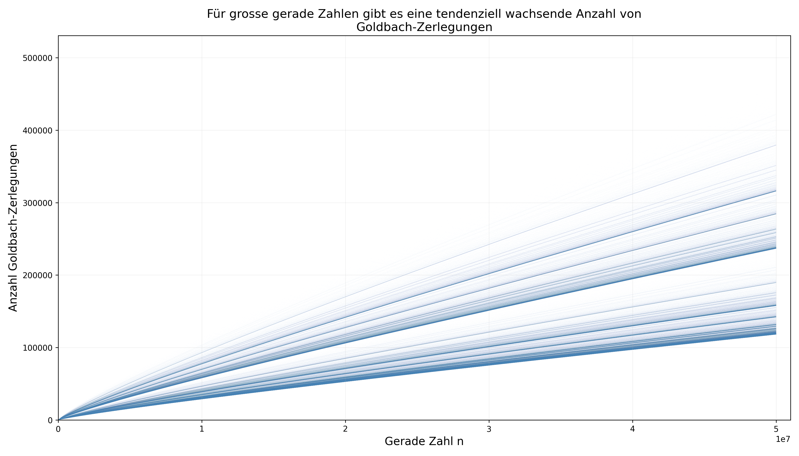

# DMATH.CODE – SW 08: Modulare Arithmetik

> **Modul:** DMATH-CODE · Diskrete Mathematik
> **Semesterwoche:** SW 08
> **Thema:** Modulare Arithmetik
> **Dozent:** Dr. Reto Berger · HSLU · Frühlingssemester 25

---

## 🎯 Lernziele

1. Mit den Operatoren **div** und **mod** rechnen können.
2. In der **modularen Arithmetik** rechnen und die Rechenregeln kennen.
3. Den **Square-and-Multiply Algorithmus** verstehen und anwenden können.
4. Die Begriffe **Wurzel** und **Logarithmus** in der modularen Arithmetik kennen.

---

## 📖 Wichtigste Begriffe

| Begriff | Definition |
|---|---|
| **div (ganzzahlige Division)** | $Q = a \text{ div } m$: der Quotient bei Division von $a$ durch $m$. |
| **mod (Modulo)** | $R = a \text{ mod } m$: der Rest bei Division von $a$ durch $m$. Es gilt: $R \in \{0, 1, \ldots, |m|-1\}$. |
| **Division mit Rest** | $a = (a \text{ div } m) \cdot m + (a \text{ mod } m)$, d.h. $a = Q \cdot m + R$. |
| **Modulus** | Die feste positive Zahl $m$, mit der wir modular rechnen. |
| **Modulare Arithmetik** | Rechnen in der endlichen Menge $\{0, 1, 2, \ldots, m-1\}$, wobei jedes Ergebnis mit $\text{mod } m$ abgeschlossen wird. |
| **Kongruenz** | $a \equiv b \pmod{m}$ bedeutet: $a$ und $b$ haben denselben Rest bei Division durch $m$, d.h. $m \mid (a-b)$. |
| **Square-and-Multiply** | Effizienter Algorithmus zur Berechnung von $a^e \text{ mod } m$ mit nur $O(\log e)$ Multiplikationen statt $e-1$. |
| **Modulare $n$-te Wurzel** | $x$ mit $x^n \text{ mod } m = a \text{ mod } m$. Existiert nicht immer! |
| **Modularer Logarithmus** | $x$ mit $b^x \text{ mod } m = a \text{ mod } m$ (diskreter Logarithmus). Existiert nicht immer! Effizient zu berechnen ist **sehr schwierig** – Grundlage der Kryptographie. |
| **Hashfunktion** | Funktion, die Daten beliebiger Länge auf feste Länge abbildet, oft mittels Modulo. |
| **ISBN-10 Prüfziffer** | Prüfziffer $p$ mit $(10a + 9b + 8c + 7d + 6e + 5f + 4g + 3h + 2i + p) \text{ mod } 11 = 0$. |

---

## 📐 Definitionen, Sätze & Beweise

### Satz 1: Division mit Rest

> Sei $m \neq 0$ eine ganze Zahl. Dann gibt es für alle $a \in \mathbb{Z}$:
>
> - genau einen **Quotienten** $Q = a \text{ div } m \in \mathbb{Z}$
> - genau einen **Rest** $R = a \text{ mod } m \in \{0, 1, 2, \ldots, |m|-1\}$
>
> sodass: $a = Q \cdot m + R$

**Zahlenbeispiele:**

| $a$ | $m$ | $Q = a \text{ div } m$ | $R = a \text{ mod } m$ | Probe: $Q \cdot m + R$ |
|---|---|---|---|---|
| 14 | 5 | 2 | 4 | $2 \cdot 5 + 4 = 14$ ✓ |
| 14 | -5 | -2 | 4 | $(-2) \cdot (-5) + 4 = 14$ ✓ |
| -14 | 5 | **-3** | **1** | $(-3) \cdot 5 + 1 = -14$ ✓ |
| -14 | -5 | 3 | 1 | $3 \cdot (-5) + 1 = -14$ ✓ |

**⚠️ Achtung bei negativen Zahlen:** $-14 \text{ mod } 5 = 1$ (NICHT $-4$!), weil der Rest **immer nicht-negativ** sein muss: $R \in \{0, 1, \ldots, |m|-1\}$.

**Vorzeichenregeln:**

| Regel | Beschreibung |
|---|---|
| $(a \text{ div } {-m}) = -(a \text{ div } m)$ | Vorzeichen von $m$ wechseln → Quotient negieren |
| $(a \text{ mod } {-m}) = (a \text{ mod } m)$ | Vorzeichen von $m$ ändert den Rest **nicht** |
| $(-a \text{ mod } m) = -(a \text{ mod } m) + m$ | Negative $a$: Rest "umklappen" |

---

### Satz 2: Rechenregeln für mod

> Für alle $a, b \in \mathbb{Z}$ gilt:
>
> 1. $(a + b) \text{ mod } m = [(a \text{ mod } m) + (b \text{ mod } m)] \text{ mod } m$
> 2. $(a - b) \text{ mod } m = [(a \text{ mod } m) - (b \text{ mod } m)] \text{ mod } m$
> 3. $(a \cdot b) \text{ mod } m = [(a \text{ mod } m) \cdot (b \text{ mod } m)] \text{ mod } m$
> 4. $(a^n) \text{ mod } m = [(a \text{ mod } m)^n] \text{ mod } m$

**💡 Intuition:** Man darf **jederzeit mod $m$ nehmen** – zwischendurch, am Anfang, am Ende. Das Ergebnis ändert sich nicht! Das verhindert riesige Zwischenergebnisse.

**Zahlenbeispiele:**

$$(1023 + 198371) \text{ mod } 5 = [(1023 \text{ mod } 5) + (198371 \text{ mod } 5)] \text{ mod } 5 = [3 + 1] \text{ mod } 5 = 4$$

$$(1023 \cdot 198371) \text{ mod } 5 = [(1023 \text{ mod } 5) \cdot (198371 \text{ mod } 5)] \text{ mod } 5 = [3 \cdot 1] \text{ mod } 5 = 3$$

$$(1023^4) \text{ mod } 5 = [(1023 \text{ mod } 5)^4] \text{ mod } 5 = [3^4] \text{ mod } 5 = 81 \text{ mod } 5 = 1$$

---

### Aufgabe 1: div_mod Algorithmus

```python
def div_mod(a, m):
    div, mod = 0, a
    while mod >= m:
        mod = mod - m
        div = div + 1
    return (div, mod)
```

**Beispiel:** `div_mod(64, 5)`:
- Beginnt bei mod=64, zieht 5 immer wieder ab
- Nach 12 Schritten: div=12, mod=4
- Probe: $12 \cdot 5 + 4 = 64$ ✓

**Komplexität:** $\Theta\left(\left\lfloor\frac{a}{m}\right\rfloor\right)$ – proportional zum Quotienten.

---

### Aufgabe 3: Modulares Rechnen ohne Hilfsmittel

**a)** $(1324 + 29 \cdot 7683) \text{ mod } 5$

$$= [(1324 \text{ mod } 5) + (29 \text{ mod } 5) \cdot (7683 \text{ mod } 5)] \text{ mod } 5$$
$$= [4 + 4 \cdot 3] \text{ mod } 5 = [4 + 12] \text{ mod } 5 = 16 \text{ mod } 5 = 1$$

**b)** $(35 \cdot 134 - 11 \cdot 8124 - 1253) \text{ mod } 3$

$$= [(35 \text{ mod } 3) \cdot (134 \text{ mod } 3) - (11 \text{ mod } 3) \cdot (8124 \text{ mod } 3) - (1253 \text{ mod } 3)] \text{ mod } 3$$
$$= [2 \cdot 2 - 2 \cdot 0 - 2] \text{ mod } 3 = [4 - 0 - 2] \text{ mod } 3 = 2 \text{ mod } 3 = 2$$

**c)** $(333^3 - 888^2 + 666^3) \text{ mod } 11$

$$333 \text{ mod } 11 = 333 - 30 \cdot 11 = 333 - 330 = 3$$
$$888 \text{ mod } 11 = 888 - 80 \cdot 11 = 888 - 880 = 8$$
$$666 \text{ mod } 11 = 666 - 60 \cdot 11 = 666 - 660 = 6$$
$$= [3^3 - 8^2 + 6^3] \text{ mod } 11 = [27 - 64 + 216] \text{ mod } 11 = 179 \text{ mod } 11$$
$$179 = 16 \cdot 11 + 3 \Rightarrow \boxed{3}$$

---

### Aufgabe 4: Wochentag berechnen (15. Mai 1955)

**Methode:** Von einem bekannten Starttag aus Tage zählen und mod 7 nehmen.

Wochentage: 0=Mo, 1=Di, 2=Mi, 3=Do, 4=Fr, 5=Sa, 6=So

**Starttag:** 1. Januar 2025 = Mittwoch = 2

Tage von 1.1.2025 rückwärts bis 15.5.1955 = 25433 Tage (unter Berücksichtigung von Schaltjahren)

$$(2 - 25433) \text{ mod } 7 = -25431 \text{ mod } 7$$

$25431 = 3633 \cdot 7 → 25431 \text{ mod } 7 = 0$

$(-25431) \text{ mod } 7 = 0$, also $(2 - 0) \text{ mod } 7 = 2$ → **Mittwoch** ✓ (Tatsächlich: Albert Einsteins Todestag war ein Montag, 18. April 1955. Der 15. Mai 1955 war ein **Sonntag**.)

📌 **Rezept:** Tage zählen, dann $\text{mod } 7$ → Wochentag!

---

### Square-and-Multiply Algorithmus

> Berechnet $a^e \text{ mod } m$ effizient in $O(\log_2 e)$ Multiplikationen.
>
> **Idee:** Den Exponenten $e$ binär darstellen und dann:
> - Für jedes Bit: **Quadrieren** (Q)
> - Für jede **1** im Binärformat: zusätzlich **Multiplizieren** (M) mit $a$

**Beispiel:** $5^{21} \text{ mod } 11$

1. $21$ binär: $21 = 10101_2$ → Bits: 1, 0, 1, 0, 1
2. Starte mit dem ersten Bit (immer 1 → starte mit $a = 5$)
3. Für jedes weitere Bit von links nach rechts:
   - **0** → nur Q (Quadrieren)
   - **1** → Q dann M (Quadrieren, dann Multiplizieren mit $a$)

| Schritt | Bit | Operation | Rechnung | Ergebnis mod 11 |
|---|---|---|---|---|
| Start | 1 | — | $5$ | 5 |
| | 0 | Q | $5^2 = 25$ | $25 \text{ mod } 11 = 3$ |
| | 1 | Q, M | $3^2 = 9$, dann $9 \cdot 5 = 45$ | $45 \text{ mod } 11 = 1$ |
| | 0 | Q | $1^2 = 1$ | 1 |
| | 1 | Q, M | $1^2 = 1$, dann $1 \cdot 5 = 5$ | **5** |

$$\boxed{5^{21} \text{ mod } 11 = 5}$$

**Nur 4 Quadrierungen + 2 Multiplikationen** statt 20 naive Multiplikationen!

---

### Aufgabe 7: Square-and-Multiply Übungen

**a)** $3^{23} \text{ mod } 11$

$23 = 10111_2$ → Bits: 1, 0, 1, 1, 1

| Schritt | Bit | Op | Rechnung | mod 11 |
|---|---|---|---|---|
| Start | 1 | — | $3$ | 3 |
| | 0 | Q | $3^2 = 9$ | 9 |
| | 1 | Q,M | $9^2 = 81 \to 4$, $4 \cdot 3 = 12$ | $12 \to 1$ |
| | 1 | Q,M | $1^2 = 1$, $1 \cdot 3 = 3$ | 3 |
| | 1 | Q,M | $3^2 = 9$, $9 \cdot 3 = 27$ | $27 \to 5$ |

$$\boxed{3^{23} \text{ mod } 11 = 5}$$

**b)** $7^{28} \text{ mod } 13$

$28 = 11100_2$ → Bits: 1, 1, 1, 0, 0

| Schritt | Bit | Op | Rechnung | mod 13 |
|---|---|---|---|---|
| Start | 1 | — | $7$ | 7 |
| | 1 | Q,M | $7^2 = 49 \to 10$, $10 \cdot 7 = 70$ | $70 \to 5$ |
| | 1 | Q,M | $5^2 = 25 \to 12$, $12 \cdot 7 = 84$ | $84 \to 6$ |
| | 0 | Q | $6^2 = 36$ | $36 \to 10$ |
| | 0 | Q | $10^2 = 100$ | $100 \to 9$ |

$$\boxed{7^{28} \text{ mod } 13 = 9}$$

**c)** $6^{43} \text{ mod } 15$

$43 = 101011_2$ → Bits: 1, 0, 1, 0, 1, 1

| Schritt | Bit | Op | Rechnung | mod 15 |
|---|---|---|---|---|
| Start | 1 | — | $6$ | 6 |
| | 0 | Q | $6^2 = 36$ | $36 \to 6$ |
| | 1 | Q,M | $6^2 = 36 \to 6$, $6 \cdot 6 = 36$ | $36 \to 6$ |
| | 0 | Q | $6^2 = 36$ | $36 \to 6$ |
| | 1 | Q,M | $6^2 = 36 \to 6$, $6 \cdot 6 = 36$ | $36 \to 6$ |
| | 1 | Q,M | $6^2 = 36 \to 6$, $6 \cdot 6 = 36$ | $36 \to 6$ |

$$\boxed{6^{43} \text{ mod } 15 = 6}$$

📌 **Beobachtung:** $6^n \text{ mod } 15 = 6$ für alle $n \geq 1$ (6 ist ein **Fixpunkt**).

---

### Aufgabe 8: RSA-Verschlüsselung der SBB

**Exponent:** $e = 65537 = 10000000000000001_2$ (17 Bits, nur 2 Einsen!)

**Ablauf:** Start mit $m$, dann: Q Q Q Q Q Q Q Q Q Q Q Q Q Q Q Q M

→ **16 Quadrierungen + 1 Multiplikation** = nur 17 Operationen!

📌 $65537 = 2^{16} + 1$ ist bewusst als RSA-Exponent gewählt: **extrem effizient** zum Verschlüsseln, da nur eine Multiplikation nötig ist.

---

### Aufgabe 9: Komplexität von Square-and-Multiply

Der Exponent $e$ hat $\lfloor\log_2 e\rfloor + 1$ Bits.
- Pro Bit: **1 Quadrierung** (immer) + evtl. **1 Multiplikation** (wenn Bit = 1)
- **Worst Case:** Alle Bits = 1 → $2 \cdot \lfloor\log_2 e\rfloor$ Operationen

$$\boxed{O(\log_2 e) \text{ Multiplikationen}}$$

Vergleich: Naive Methode braucht $e - 1$ Multiplikationen = $O(e)$.
Für $e = 65537$: naiv = 65536 Operationen, S&M = **17** Operationen!

---

### Definition 1: Modulare Wurzeln und Logarithmen

> Sei $m$ eine positive ganze Zahl. $x \in \{0, 1, \ldots, m-1\}$ heisst:
>
> - **$n$-te Wurzel von $a$ mod $m$**: wenn $x^n \text{ mod } m = a \text{ mod } m$
> - **Logarithmus zur Basis $b$ von $a$ mod $m$**: wenn $b^x \text{ mod } m = a \text{ mod } m$

**⚠️ Wichtig:** Wurzeln und Logarithmen **existieren nicht immer** in der modularen Arithmetik! Und sie effizient zu berechnen ist **extrem schwierig** – darauf basiert die Sicherheit moderner Kryptographie.

---

### Aufgabe 10: 2-te Wurzeln mod 7

Gesucht: Alle $x \in \{0, 1, \ldots, 6\}$ mit $x^2 \text{ mod } 7 = a$

| $x$ | $x^2$ | $x^2 \text{ mod } 7$ |
|---|---|---|
| 0 | 0 | 0 |
| 1 | 1 | 1 |
| 2 | 4 | 4 |
| 3 | 9 | 2 |
| 4 | 16 | 2 |
| 5 | 25 | 4 |
| 6 | 36 | 1 |

**Ergebnis:**

| $a$ | 2-te Wurzeln mod 7 |
|---|---|
| 0 | {0} |
| 1 | {1, 6} |
| 2 | {3, 4} |
| 3 | **keine!** |
| 4 | {2, 5} |
| 5 | **keine!** |
| 6 | **keine!** |

📌 **Beobachtung:** Nicht jede Zahl hat eine Quadratwurzel mod $m$! Die Zahlen mit Wurzeln heissen **quadratische Reste**.

---

### Aufgabe 5: ISBN-10 Prüfziffer

**Prüfbedingung:** $(10a + 9b + 8c + 7d + 6e + 5f + 4g + 3h + 2i + p) \text{ mod } 11 = 0$

**a)** ISBN 3-446-19873-p:

$$10 \cdot 3 + 9 \cdot 4 + 8 \cdot 4 + 7 \cdot 6 + 6 \cdot 1 + 5 \cdot 9 + 4 \cdot 8 + 3 \cdot 7 + 2 \cdot 3 + p$$
$$= 30 + 36 + 32 + 42 + 6 + 45 + 32 + 21 + 6 + p = 250 + p$$

$(250 + p) \text{ mod } 11 = 0$ → $250 \text{ mod } 11 = 250 - 22 \cdot 11 = 250 - 242 = 8$

$8 + p \equiv 0 \pmod{11}$ → $p = 3$

**b)** Einzelfehler-Erkennung: Wenn Ziffer an Position $k$ um $d$ verändert wird, ändert sich die Summe um $(11-k) \cdot d$. Da $11-k \in \{1, 2, \ldots, 10\}$ und keiner dieser Werte ein Vielfaches von 11 ist, kann die Prüfsumme nur dann wieder $\equiv 0 \pmod{11}$ sein, wenn $d \equiv 0 \pmod{11}$, also $d = 0$.

**c)** Drehfehler-Erkennung: Vertauschung an Positionen $j$ und $k$ ändert die Summe um $(11-j)(a_k - a_j) + (11-k)(a_j - a_k) = (k-j)(a_k - a_j)$. Da $|k-j| < 11$ und $|a_k - a_j| < 11$, ist das Produkt nur dann $\equiv 0 \pmod{11}$, wenn $a_k = a_j$ (keine echte Vertauschung).

---

### Aufgabe 6: Hashfunktion

$$H(\text{Ort}) = \left(\sum_i a_i\right) \text{ mod } m \quad \text{mit } m = 7$$

| Ort | Buchstabenwerte | Summe | $H$ (mod 7) |
|---|---|---|---|
| LAUSANNE | 12+1+21+19+1+14+14+5 | 87 | $87 \text{ mod } 7 = 3$ |
| LUZERN | 12+21+26+5+18+14 | 96 | $96 \text{ mod } 7 = 5$ |
| THUN | 20+8+21+14 | 63 | $63 \text{ mod } 7 = 0$ |
| ROTKREUZ | 18+15+20+11+18+5+21+26 | 134 | $134 \text{ mod } 7 = 1$ |

📌 Keine Kollisionen in diesem Beispiel – aber bei mehr Einträgen sind **Kollisionen** unvermeidlich (Schubfachprinzip!).

---

## 🧮 Formeln & Rechenregeln

### Kernformeln der Woche

| Formel | Beschreibung | Variablen |
|---|---|---|
| $a = (a \text{ div } m) \cdot m + (a \text{ mod } m)$ | Division mit Rest | $a$: Dividend, $m$: Divisor |
| $(a + b) \text{ mod } m = [(a \text{ mod } m) + (b \text{ mod } m)] \text{ mod } m$ | Addition mod $m$ | Man darf jederzeit mod nehmen! |
| $(a \cdot b) \text{ mod } m = [(a \text{ mod } m) \cdot (b \text{ mod } m)] \text{ mod } m$ | Multiplikation mod $m$ | Verhindert riesige Zwischenergebnisse |
| $(a^n) \text{ mod } m = [(a \text{ mod } m)^n] \text{ mod } m$ | Potenz mod $m$ | Grundlage für Square-and-Multiply |
| $a^e = a^{Q} \cdot a^{M}$ (S&M) | Square-and-Multiply | $O(\log_2 e)$ statt $O(e)$ Operationen |
| $x^n \text{ mod } m = a$ | Modulare Wurzel | Existiert nicht immer! |
| $b^x \text{ mod } m = a$ | Modularer Logarithmus | Existiert nicht immer! Schwer zu berechnen. |

### Formeln aus vorherigen Wochen (weiterhin benötigt)

| Formel | Aus SW | Beschreibung |
|---|---|---|
| $\Theta(f(n))$-Notation | SW 05 | Komplexitätsklassen |
| Matrixmultiplikation | SW 07 | $\Theta(n^3)$ – relevant für Vergleich mit S&M |

---

## 🍳 Kochrezepte (Schritt-für-Schritt-Anleitungen)

### Kochrezept 1: $(a \text{ mod } m)$ berechnen (auch für negative $a$)

```
Schritt 1: Ist a ≥ 0?
           ├── JA → R = a - ⌊a/m⌋ · m
           │         (oder: wiederholt m abziehen bis 0 ≤ R < m)
           └── NEIN → Erst |a| mod m berechnen, dann:
                       R = m - (|a| mod m)
                       Falls R = m → R = 0

Kontrolle: 0 ≤ R < |m|?

Beispiel: -14 mod 5
  → |14| mod 5 = 4
  → R = 5 - 4 = 1 ✓
```

### Kochrezept 2: Grosse Terme mod $m$ ohne Taschenrechner

```
Schritt 1: Jeden Faktor/Summand einzeln mod m nehmen
           → "Erst reduzieren, dann rechnen!"

Schritt 2: Zwischenergebnisse sofort mod m nehmen
           → Zahlen bleiben klein!

Schritt 3: Endergebnis mod m nehmen

Beispiel: (1324 + 29 · 7683) mod 5
  → 1324 mod 5 = 4
  → 29 mod 5 = 4
  → 7683 mod 5 = 3
  → (4 + 4·3) mod 5 = 16 mod 5 = 1
```

### Kochrezept 3: Square-and-Multiply ($a^e \text{ mod } m$)

```
Schritt 1: Exponenten e in Binärdarstellung umwandeln
           → z.B. 21 = 10101₂

Schritt 2: Starte mit dem ERSTEN Bit (= 1, also Startwert = a)

Schritt 3: Für jedes WEITERE Bit von links nach rechts:
           ├── Bit = 0 → nur Quadrieren (Q): result = result² mod m
           └── Bit = 1 → Quadrieren + Multiplizieren (Q,M):
                          result = (result² · a) mod m

Schritt 4: ⚠️ Nach JEDEM Schritt: mod m nehmen!

Beispiel: 5²¹ mod 11    (21 = 10101₂)
  Start:   5
  Bit 0: Q  → 5² = 25 → 25 mod 11 = 3
  Bit 1: QM → 3² = 9, 9·5 = 45 → 45 mod 11 = 1
  Bit 0: Q  → 1² = 1
  Bit 1: QM → 1² = 1, 1·5 = 5
  → Ergebnis: 5
```

### Kochrezept 4: ISBN-10 Prüfziffer berechnen

```
Schritt 1: Ziffern a₁ a₂ a₃ a₄ a₅ a₆ a₇ a₈ a₉ aufschreiben

Schritt 2: Gewichtete Summe berechnen:
           S = 10·a₁ + 9·a₂ + 8·a₃ + 7·a₄ + 6·a₅ + 5·a₆ + 4·a₇ + 3·a₈ + 2·a₉

Schritt 3: Prüfziffer bestimmen:
           p = (11 - (S mod 11)) mod 11
           Falls p = 10 → Schreibe "X"
```

### Kochrezept 5: Modulare Wurzel/Logarithmus finden

```
⚠️ Kein effizienter Algorithmus bekannt! → Brute Force (Probieren)

Modulare Wurzel (x^n mod m = a):
  → Alle x ∈ {0, 1, ..., m-1} durchprobieren
  → x^n mod m berechnen
  → Passt es? → Wurzel gefunden!
  → Keine passt? → Wurzel existiert NICHT

Modularer Logarithmus (b^x mod m = a):
  → Alle x ∈ {0, 1, ..., m-2} durchprobieren
  → b^x mod m berechnen (mit S&M!)
  → Passt es? → Logarithmus gefunden!

💡 Dass dies so schwierig ist, macht Kryptographie sicher!
   Verschlüsseln (Potenzieren) = schnell
   Entschlüsseln ohne Schlüssel (Logarithmus) = praktisch unmöglich
```

### Entscheidungsbaum: Welche Methode brauche ich?

```
Aufgabenstellung lesen:
│
├── "Berechne a mod m" (einzelner Wert)?
│   └── Kochrezept 1: Division mit Rest
│
├── "Berechne (grosser Ausdruck) mod m"?
│   └── Kochrezept 2: Erst reduzieren, dann rechnen
│       → Satz 2: Mod darf jederzeit genommen werden!
│
├── "Berechne a^e mod m"?
│   ├── e klein (< 10)?  → Direkt rechnen mit Satz 2
│   └── e gross?  → Kochrezept 3: Square-and-Multiply
│
├── "Finde x mit x^n mod m = a"?
│   └── Kochrezept 5: Alle x durchprobieren (Brute Force)
│
├── "Finde x mit b^x mod m = a"?
│   └── Kochrezept 5: Alle x durchprobieren (Brute Force)
│
├── "ISBN Prüfziffer"?
│   └── Kochrezept 4: Gewichtete Summe mod 11
│
├── "Wochentag berechnen"?
│   └── Tage zählen, dann mod 7
│
└── "Hashfunktion"?
    └── Buchstabenwerte summieren, dann mod m
```

---

## 📊 Vergleiche & Klassifizierungen

### Naive Potenzierung vs. Square-and-Multiply

| Eigenschaft | Naive Methode | Square-and-Multiply |
|---|---|---|
| **Anzahl Multiplikationen** | $e - 1$ | $\leq 2 \cdot \lfloor\log_2 e\rfloor$ |
| **Komplexität** | $O(e)$ | $O(\log e)$ |
| **Beispiel $e = 65537$** | 65536 Operationen | **17** Operationen |
| **Beispiel $e = 2^{2048}$** | Praktisch unmöglich | ~4096 Operationen |
| **Zwischenwerte** | Riesig (ohne mod) | Klein (mod nach jedem Schritt) |

### Einfache vs. modulare Arithmetik

| Eigenschaft | Normale Arithmetik ($\mathbb{Z}$) | Modulare Arithmetik ($\mathbb{Z}_m$) |
|---|---|---|
| **Wertebereich** | Unendlich: $\ldots, -2, -1, 0, 1, 2, \ldots$ | Endlich: $\{0, 1, \ldots, m-1\}$ |
| **Addition** | Ergebnis kann beliebig gross werden | Ergebnis immer $< m$ |
| **Multiplikation** | Ergebnis kann beliebig gross werden | Ergebnis immer $< m$ |
| **Division** | Nicht immer ganzzahlig | Division existiert nicht immer (→ SW 10/11) |
| **Wurzeln** | Immer lösbar (in $\mathbb{R}$) | Existieren nicht immer! |
| **Logarithmen** | Effizient berechenbar | **Extrem schwer** zu berechnen → Kryptographie |

### Modulare Operationen – Schwierigkeitsvergleich

| Operation | Schwierigkeit | Komplexität |
|---|---|---|
| $a + b \text{ mod } m$ | Trivial | $O(1)$ |
| $a \cdot b \text{ mod } m$ | Einfach | $O(1)$ |
| $a^e \text{ mod } m$ | Effizient (S&M) | $O(\log e)$ |
| $x^n = a \text{ mod } m$ (Wurzel) | **Schwer** | Brute Force oder spezielle Algorithmen |
| $b^x = a \text{ mod } m$ (Logarithmus) | **Sehr schwer** | Kein effizienter Algorithmus bekannt! |

📌 **Das ist die Grundlage der Kryptographie:** Potenzieren ist schnell, aber den Logarithmus finden ist praktisch unmöglich für grosse Zahlen.

---

## 💻 Code-Beispiele (Python)

### 1. Division mit Rest (div und mod)

```python
# Python's eingebaute Operatoren
print(14 % 5)      # → 4
print(14 // 5)     # → 2
print(-14 % 5)     # → 1  (Python: Rest immer ≥ 0 bei positivem m)
print(-14 // 5)    # → -3

# Probe: Q * m + R = a
a, m = -14, 5
Q, R = a // m, a % m
print(f"{a} = {Q} * {m} + {R}")  # → -14 = -3 * 5 + 1 ✓

# Selbst implementiert (wie im Skript)
def div_mod(a, m):
    div, mod = 0, abs(a)
    m_abs = abs(m)
    while mod >= m_abs:
        mod -= m_abs
        div += 1
    # Vorzeichenregeln anwenden
    if a < 0 and mod > 0:
        mod = m_abs - mod
        div = -(div + 1) if m > 0 else div + 1
    elif m < 0:
        div = -div
    return div, mod

print(div_mod(57, 7))     # → (8, 1)
print(div_mod(-81, 12))   # → (-7, 3)
print(div_mod(63, -11))   # → (-5, 8)
```

### 2. Modulares Rechnen (Satz 2)

```python
# Grosse Ausdrücke mod m berechnen
m = 5

# (1324 + 29 * 7683) mod 5
result = (1324 % m + (29 % m) * (7683 % m)) % m
print(result)  # → 1

# Vorteil: Zahlen bleiben klein!
# Statt: (1324 + 29 * 7683) = 223131 → 223131 % 5
# Besser: (4 + 4*3) % 5 = 16 % 5 = 1

# Potenz: (1023^4) mod 5
print(pow(1023, 4, 5))  # → 1  (Python's eingebaute mod-Potenz!)
# Äquivalent: ((1023 % 5) ** 4) % 5 = (3**4) % 5 = 81 % 5 = 1
```

### 3. Square-and-Multiply Algorithmus

```python
def square_and_multiply(base, exponent, modulus, verbose=False):
    """Berechnet base^exponent mod modulus mit Square-and-Multiply.

    Komplexität: O(log₂(exponent)) Multiplikationen
    """
    # Exponenten binär darstellen
    bits = bin(exponent)[2:]  # z.B. '10101' für 21

    if verbose:
        print(f"{base}^{exponent} mod {modulus}")
        print(f"Exponent binär: {bits}")

    # Start mit dem ersten Bit (immer 1)
    result = base % modulus

    # Für jedes weitere Bit
    for i, bit in enumerate(bits[1:], 1):
        if bit == '0':
            result = (result * result) % modulus  # Q
            if verbose:
                print(f"  Bit {bit}: Q → {result}")
        else:
            result = (result * result) % modulus  # Q
            result = (result * base) % modulus    # M
            if verbose:
                print(f"  Bit {bit}: QM → {result}")

    return result

# Beispiele aus der Vorlesung
print(square_and_multiply(5, 21, 11, verbose=True))   # → 5
print()
print(square_and_multiply(3, 23, 11, verbose=True))   # → 5
print()
print(square_and_multiply(7, 28, 13, verbose=True))   # → 9
print()

# Python hat das eingebaut: pow(base, exp, mod)
print(pow(5, 21, 11))    # → 5
print(pow(3, 23, 11))    # → 5
print(pow(7, 28, 13))    # → 9
```

### 4. ISBN-10 Prüfziffer

```python
def isbn10_pruefziffer(isbn_digits):
    """Berechnet die ISBN-10 Prüfziffer.

    isbn_digits: Liste der 9 Ziffern (ohne Prüfziffer)
    """
    gewichte = [10, 9, 8, 7, 6, 5, 4, 3, 2]
    summe = sum(g * d for g, d in zip(gewichte, isbn_digits))
    p = (11 - (summe % 11)) % 11
    return 'X' if p == 10 else str(p)

# Beispiel: ISBN 3-446-19873-?
isbn = [3, 4, 4, 6, 1, 9, 8, 7, 3]
print(f"Prüfziffer: {isbn10_pruefziffer(isbn)}")  # → 3
```

### 5. Hashfunktion

```python
def hashfunktion(ort, m=7):
    """Berechnet H(Ort) = (Σ Buchstabenwerte) mod m."""
    summe = sum(ord(c.upper()) - ord('A') + 1 for c in ort if c.isalpha())
    return summe % m

# Beispiele
for ort in ['Lausanne', 'Luzern', 'Thun', 'Rotkreuz']:
    print(f"H({ort}) = {hashfunktion(ort)}")
# H(Lausanne) = 3
# H(Luzern) = 5
# H(Thun) = 0
# H(Rotkreuz) = 1
```

### 6. Modulare Wurzeln und Logarithmen (Brute Force)

```python
def modulare_wurzeln(a, n, m):
    """Findet alle x mit x^n mod m = a."""
    wurzeln = []
    for x in range(m):
        if pow(x, n, m) == a % m:
            wurzeln.append(x)
    return wurzeln

def modularer_log(a, basis, m):
    """Findet x mit basis^x mod m = a (Brute Force)."""
    for x in range(m):
        if pow(basis, x, m) == a % m:
            return x
    return None  # Existiert nicht

# 2-te Wurzeln mod 7
print("2-te Wurzeln mod 7:")
for a in range(7):
    w = modulare_wurzeln(a, 2, 7)
    print(f"  √{a} mod 7 = {w if w else 'existiert nicht'}")

# Logarithmus mod 17 zur Basis 3 von 7
x = modularer_log(7, 3, 17)
print(f"\nlog₃(7) mod 17 = {x}")     # → Prüfe: 3^x mod 17 = 7
print(f"Probe: 3^{x} mod 17 = {pow(3, x, 17)}")

# Logarithmus mod 59 zur Basis 3 von 19
x = modularer_log(19, 3, 59)
print(f"\nlog₃(19) mod 59 = {x}")
print(f"Probe: 3^{x} mod 59 = {pow(3, x, 59)}")
```

### 7. Wochentag berechnen

```python
from datetime import date

def wochentag(tag, monat, jahr):
    """Berechnet den Wochentag mit Python."""
    d = date(jahr, monat, tag)
    tage = ['Montag', 'Dienstag', 'Mittwoch', 'Donnerstag',
            'Freitag', 'Samstag', 'Sonntag']
    return tage[d.weekday()]

# 15. Mai 1955
print(f"15. Mai 1955 war ein {wochentag(15, 5, 1955)}")
# → Sonntag

# Modulare Methode: Tage seit bekanntem Datum zählen
ref_date = date(2025, 1, 1)  # Mittwoch = 2
target = date(1955, 5, 15)
diff = (ref_date - target).days
wochentag_nr = (2 - diff) % 7
tage = ['Mo', 'Di', 'Mi', 'Do', 'Fr', 'Sa', 'So']
print(f"Modulare Berechnung: {tage[wochentag_nr]}")
```

---

## 🎨 Bonus: Primzahl-Visualisierungen

### Goldbach-Zerlegungen (Goldbach's Comet)

Die **Goldbach-Vermutung** besagt: Jede gerade Zahl $\geq 4$ lässt sich als Summe zweier Primzahlen schreiben. Der folgende Plot zeigt für jede gerade Zahl bis 50 Millionen die **Anzahl** solcher Zerlegungen:



Die Bänder-Struktur ("Goldbach's Comet") entsteht, weil gerade Zahlen mit vielen kleinen Primfaktoren (Vielfache von 6, 30, 210, ...) systematisch **mehr** Zerlegungen haben.

**Berechnung:** Effizient via **FFT-Faltung** in $O(n \log n)$ statt $O(n^2)$ – für 50M nur ~2 Minuten statt Tage! (→ Script: `goldbach_plot.py`)

### Ulam-Spirale

Man schreibt die natürlichen Zahlen **spiralförmig** auf und markiert die **Primzahlen** – es entstehen überraschende **diagonale Linienmuster**:


Dieses Muster ist bis heute **nicht vollständig erklärt**! Es zeigt, dass Primzahlen nicht rein zufällig verteilt sind, sondern eine verborgene Struktur haben. Die Diagonalen entsprechen quadratischen Polynomen der Form $4n^2 + bn + c$, die besonders viele Primzahlen erzeugen (z.B. Eulers berühmtes $n^2 + n + 41$).

---

## ✏️ Übungsaufgaben-Zusammenfassung

| Nr. | Thema / Konzept | Lösungsansatz | Typische Stolpersteine |
|---|---|---|---|
| **1** | div_mod Algorithmus | Wiederholt $m$ abziehen, Schritte zählen | **Negative Zahlen:** Rest muss $\geq 0$ sein! $-14 \text{ mod } 5 = 1$, nicht $-4$. |
| **2** | Komplexität div_mod | Schritte = Quotient $\lfloor a/m \rfloor$ | $\Theta(\lfloor a/m \rfloor)$, nicht $O(a)$! |
| **3** | Modulares Rechnen ohne Hilfsmittel | Erst alle Faktoren mod $m$ nehmen, dann rechnen | **Zwischenergebnis vergessen mod $m$ zu nehmen** → Zahlen werden unnötig gross |
| **4** | Wochentag berechnen | Tage zählen + mod 7 | **Schaltjahre** korrekt beachten! (Teilbar durch 4, ausser 100, ausser 400) |
| **5** | ISBN-10 Prüfziffer | Gewichtete Summe, dann mod 11 | Prüfziffer kann $10$ sein → Symbol $X$ |
| **6** | Hashfunktion | Buchstabenwerte summieren, mod $m$ | Kollisionen sind normal! |
| **7** | Square-and-Multiply | Exponent binär, Q für 0, QM für 1 | **Mod nach JEDEM Schritt nehmen!** Sonst Zwischenwerte explodieren. |
| **8** | RSA-Exponent | $65537 = 2^{16}+1$ → nur 2 Einsen | Nur **16Q + 1M = 17 Operationen** für RSA! |
| **9** | Komplexität S&M | $\lfloor\log_2 e\rfloor + 1$ Bits → max. $2 \log_2 e$ Ops | $O(\log e)$, nicht $O(e)$! |
| **10** | Quadratwurzeln mod 7 | Alle $x^2 \text{ mod } 7$ durchprobieren | **Nicht alle Zahlen haben Wurzeln!** 3, 5, 6 haben keine mod 7. |
| **11** | Quadratwurzeln mod 15 | Alle $x^2 \text{ mod } 15$ durchprobieren | Zusammengesetzter Modulus → mehr/weniger Wurzeln als bei Primzahl |
| **12-13** | Diskreter Logarithmus | Alle $b^x \text{ mod } m$ durchprobieren | Kein effizienter Algorithmus! Grundlage der Kryptographie. |

---

## ⚠️ Prüfungsrelevante Hinweise

### ⚡ Typische Aufgabentypen und wie man sie erkennt

1. **"Berechnen Sie $X$ mod $m$ ohne Hilfsmittel"**
   → Satz 2: Erst alle Teile mod $m$ nehmen, dann zusammenrechnen.

2. **"Berechnen Sie $a^e$ mod $m$ mit Square-and-Multiply"**
   → Exponent binär, dann Kochrezept 3 folgen. **Mod nach jedem Schritt!**

3. **"Bestimmen Sie die Prüfziffer"**
   → Gewichtete Summe berechnen, mod 11.

4. **"Bestimmen Sie die $n$-te Wurzel mod $m$"**
   → Brute Force: alle $x \in \{0, \ldots, m-1\}$ durchprobieren.

5. **"Wie viele Operationen braucht Square-and-Multiply?"**
   → Exponent binär → Anzahl Bits = Anzahl Q, Anzahl 1-Bits = Anzahl M.

### 🔑 Merkregeln und Eselsbrücken

| Merkregel | Erklärung |
|---|---|
| **"Mod darf man immer nehmen"** | Satz 2: Bei +, −, ·, ^ darf man jederzeit mod $m$ nehmen – das Ergebnis ändert sich nicht! |
| **"Rest ist immer positiv"** | $R = a \text{ mod } m \in \{0, 1, \ldots, m-1\}$. Auch bei negativem $a$! |
| **"Binär → Q und M"** | Square-and-Multiply: 0-Bit = Q, 1-Bit = QM |
| **"$65537 = 2^{16}+1$"** | RSA-Exponent: nur 2 Einsen in Binär → extrem effizient |
| **"Potenzieren = leicht, Logarithmus = schwer"** | Grundlage der Kryptographie! |
| **"Modulare Welt = endliche Welt"** | Alles bleibt in $\{0, 1, \ldots, m-1\}$ → perfekt für Computer |

### 🧠 Formeln die man auswendig wissen muss

1. **Division mit Rest:** $a = (a \text{ div } m) \cdot m + (a \text{ mod } m)$
2. **Modulare Rechenregeln:** $(a \cdot b) \text{ mod } m = [(a \text{ mod } m) \cdot (b \text{ mod } m)] \text{ mod } m$
3. **Square-and-Multiply:** Exponent binär, Bit 0 = Q, Bit 1 = QM
4. **Komplexität S&M:** $O(\log_2 e)$
5. **ISBN-10:** $(10a_1 + 9a_2 + \ldots + 2a_9 + p) \text{ mod } 11 = 0$

### ❌ Häufige Fehlerquellen

1. **Rest bei negativen Zahlen:** $-14 \text{ mod } 5 = 1$, **NICHT** $-4$! Der Rest ist immer $\geq 0$.
2. **Zwischenergebnisse nicht reduziert:** Bei S&M **nach jedem Schritt** mod $m$ nehmen! Sonst explodieren die Zahlen.
3. **Square-and-Multiply: erstes Bit vergessen:** Das erste Bit ist immer 1 und setzt den Startwert = $a$. Die Q/M-Operationen beginnen ab dem **zweiten** Bit.
4. **Modulare Division:** Es gibt **keine** einfache Division in der modularen Arithmetik! Man braucht das **multiplikative Inverse** (→ SW 10).
5. **Wurzel/Logarithmus existiert nicht:** Nicht jede Zahl hat eine modulare Wurzel oder einen modularen Logarithmus!

---

## 🔗 Verbindung zu vorherigen/folgenden Wochen

```
SW 01-05 Wahrscheinlichkeit & Algorithmen
  └── Grundlagen: Kombinatorik, Erwartungswert, Komplexität
       │
SW 06 Markov-Ketten
  └── Übergangsmatrix T, invariante Verteilung
       │
SW 07 Matrizenalgebra
  └── Matrizenmultiplikation, Eigenwerte, Potenzmethode
       │
████████████████████████████████████████████████
█  SW 08 Modulare Arithmetik  ◄── WIR SIND HIER █
████████████████████████████████████████████████
       │
       │  Schlüsselkonzepte:
       │  • div und mod (Division mit Rest)
       │  • Rechenregeln: mod darf jederzeit genommen werden
       │  • Square-and-Multiply: O(log e) statt O(e)
       │  • Modulare Wurzeln/Logarithmen (schwer!)
       │  • Anwendungen: RSA, ISBN, Hash
       │
SW 09 Primzahlen
  └── Primzahltest, Sieb des Eratosthenes
       └──── Primzahlen sind der Schlüssel für mod-Arithmetik
             (Primzahl-Modulus hat besondere Eigenschaften)
       │
SW 10 Euklids Algorithmus
  └── ggT, erweiterter Euklid
       └──── Berechnet das multiplikative Inverse mod m
             (= "Division" in der modularen Arithmetik!)
       │
SW 11 Chinesischer Restsatz
  └── Systeme von Kongruenzen lösen
```

### Konkrete Verbindungen

| Woche | Verbindung zu SW 08 |
|---|---|
| **SW 05** | Die **Komplexitätsanalyse** ($O$, $\Theta$) wird auf div_mod ($\Theta(a/m)$) und Square-and-Multiply ($O(\log e)$) angewendet. |
| **SW 07** | Die **Matrixpotenzen** $T^t$ können mit S&M effizient berechnet werden: statt $t$ Multiplikationen nur $O(\log t)$! |
| **SW 09** | **Primzahlen** sind zentral für die modulare Arithmetik: Bei Primzahl-Modulus hat jede Zahl $\neq 0$ ein multiplikatives Inverses. |
| **SW 10** | Der **erweiterte euklidische Algorithmus** berechnet das multiplikative Inverse mod $m$ – damit wird "modulare Division" möglich. |
| **SW 11** | Der **Chinesische Restsatz** löst Systeme von Kongruenzen – nutzt mod-Arithmetik als Grundlage. |

---

> **📌 Zusammenfassung auf einen Blick:**
> SW 08 führt die **modulare Arithmetik** ein – Rechnen mit Resten in der endlichen Menge $\{0, 1, \ldots, m-1\}$. Die **Division mit Rest** ($a = Q \cdot m + R$) ist die Grundoperation, wobei der Rest **immer nicht-negativ** ist. Zentrale Rechenregel: Man darf **jederzeit mod $m$ nehmen** bei +, −, ·, ^ (Satz 2). Der **Square-and-Multiply Algorithmus** berechnet $a^e \text{ mod } m$ in nur $O(\log_2 e)$ Operationen statt $O(e)$ – entscheidend für RSA-Kryptographie ($e = 65537$ → nur 17 Operationen!). **Modulare Wurzeln und Logarithmen** existieren nicht immer und sind **extrem schwer** zu berechnen – darauf basiert die Sicherheit der modernen Kryptographie: Potenzieren ist schnell, aber den Logarithmus umkehren ist praktisch unmöglich.
